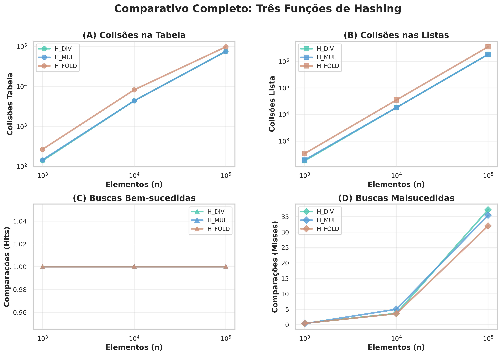
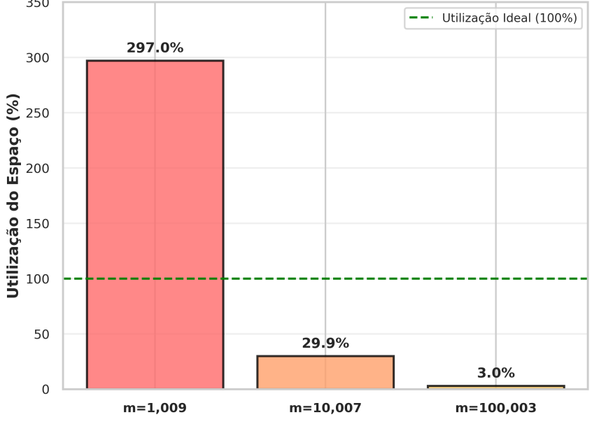

# Trabalho de Recuperacao - RA3 (HASH)

Autor: Gustavo Tasca Lazzari
Periodo/Turma: 4U

# Intruções de Execução

Basta clonar o repositório, e entrar no diretório:
```zsh
git clone https://github.com/GLazzari1428/REC_RA3.git
cd REC_RA3/
```
E por fim compilar e executar utilizando o runtime Java:
```zsh
javac *.java && java Main
```

# Gráficos

## 1. Gráficos Comparativos



## 2. Gráficos Fold

 
